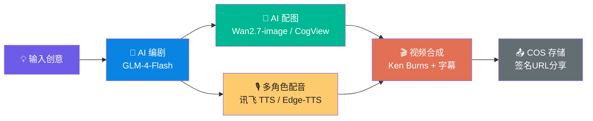

<div align="center">

# Shortify AI 🎬

[](LICENSE)
[](package.json)
[](package.json)
[](lib/ai/)
[](scripts/)


### ✨ 输入创意，输出成品 — AI 短剧创作平台

**从一行创意到完整短剧：AI 编剧 → 分镜配图 → 多角色配音 → 1080P 视频合成**

[🌐 在线体验](https://craftmind.cn) · [📖 功能介绍](#-功能特性) · [🚀 快速开始](#-快速开始)

---

</div>

## 📸 效果概览

> **一张图看懂 Shortify AI 的工作流：**



## 🎯 为什么做 Shortify AI?

短剧市场 2025 年规模超 500 亿元，但创作门槛极高：
- 🎭 **剧本** → 需要编剧能力
- 🎨 **分镜** → 需要美术/导演能力
- 🎙️ **配音** → 需要录音棚/配音演员
- 🎬 **剪辑** → 需要视频编辑软件

**Shortify AI 把这 4 步全部自动化。** 你只需要输入一个想法，其余交给 AI。

---

## ✨ 功能特性

### 🎭 AI 智能编剧
输入创意主题（如"古代丫鬟穿越到现代职场"），AI 自动生成：
- 结构化剧本（角色对话格式）
- 分镜头拆解（每个镜头包含角色、台词、场景描述）
- 旁白与对话混合编排

> 支持两个版本：V1 旁白式 / V2 角色对话式（推荐）

### 🎨 AI 分镜配图
- 单集配图 / 逐镜头配图
- 多种生图模型可选：Wan2.7-image、CogView-3-Plus、Wanx-v1
- 自动上传至腾讯云 COS（私有桶 + 签名 URL）
- 支持 16:9 横屏和 9:16 竖屏

### 🎙️ 多角色智能配音
- 自动识别剧本角色性别/身份 → 分配对应音色
- 男声 / 女声 / 旁白 / 童声等多种音色
- **讯飞 TTS**（WebSocket，优先使用）+ **Edge-TTS**（自动降级）
- 角色一致性：同一角色全剧使用同一个 voiceId

### 🎬 1080P 视频合成
| 功能 | 说明 |
|------|------|
| **Ken Burns 运镜** | 10 种运镜效果（推近/拉远/左移/右移/聚焦/旋转等） |
| **AI 视频生成** | 支持 Wan2.7-t2v / CogVideoX-3 等模型 |
| **字幕烧录** | SRT → ASS，底部居中白色黑边，自动适配时长 |
| **BGM 背景音乐** | 上传自定义音乐，可调节音量混入配音 |
| **视频质量** | CRF 18, preset medium, yuv420p, 1080P |
| **流畅拼接** | xfade 转场（自动降级为 simple concat）|

### 📤 导出与分享
- 腾讯云 COS 签名 URL → 一键下载
- 视频在线播放（浏览器/移动端均可）
- 公开分享链接
- 封面图自动生成（视频第一帧）

### ⚙️ 平台功能
- 🔐 **NextAuth JWT 登录**（邮箱 + 密码）
- 💰 **积分系统**（注册送 200，各操作扣积分）
- 🎨 **12 种故事风格**（写实/动漫/水墨/赛博朋克等）
- 📱 **响应式设计**（移动端 + 桌面端完美适配）
- 📊 **创作看板**（进度跟踪、管理作品）
- 🗑️ **作品管理**（编辑/复制/删除）

---

## 🏗️ 项目架构

```
shortify-ai/
├── app/                          # Next.js 16 App Router
│   ├── api/generate/             # AI 生成 API
│   │   ├── script/               #   剧本生成
│   │   ├── storyboard/           #   分镜生成
│   │   ├── voiceover/            #   配音生成
│   │   └── video/                #   视频合成
│   ├── (dashboard)/              # 用户主界面
│   │   ├── dramas/               #   作品列表
│   │   └── create/               #   新建短剧
│   └── share/                    # 公开分享页
├── lib/ai/                       # AI 核心引擎
│   ├── glm-client.ts             #   智谱 GLM 调用
│   ├── script-generator.ts       #   剧本生成
│   ├── image-generator.ts        #   图片生成路由
│   ├── wan-image-generator.ts    #   阿里百炼生图
│   ├── video-generator.ts        #   视频生成路由
│   ├── wan-video-generator.ts    #   阿里百炼视频
│   ├── voiceover-generator.ts    #   配音生成
│   ├── xunfei-tts.ts            #   讯飞 TTS
│   ├── subtitle-generator.ts     #   字幕生成
│   ├── video-composer.ts         #   FFmpeg 合成
│   ├── cos-storage.ts            #   腾讯云 COS
│   └── model-resolver.ts         #   模型配置解析
├── scripts/                      # 独立运行脚本
│   ├── full-pipeline.ts          #   全集一键生成
│   └── gen-pipeline.ts           #   分步生成
├── drizzle/                      # 数据库 Schema
└── uploads/                      # 本地文件缓存
```

---

## 🛠️ 技术栈

| 类别 | 技术 |
|------|------|
| **前端** | Next.js 16 (App Router) + React 19 |
| **UI** | Tailwind CSS v4 + shadcn/ui + Dark Mode |
| **数据库** | PostgreSQL + Drizzle ORM |
| **认证** | NextAuth.js v5 (JWT, Credentials) |
| **AI 编剧** | GLM-4-Flash / DeepSeek / Qwen |
| **AI 生图** | Wan2.7-image / CogView-3-Plus / Wanx-v1 |
| **AI 视频** | Wan2.7-t2v / CogVideoX-3 |
| **AI 配音** | 讯飞 TTS (WebSocket) + Edge-TTS |
| **视频合成** | FFmpeg (zoompan + concat + subtitles) |
| **存储** | 腾讯云 COS (私有桶 + 签名 URL) |
| **部署** | PM2 + Nginx (反向代理) |

---

## 🚀 快速开始

### 前置条件

```bash
# 必需
Node.js >= 18
PostgreSQL >= 14
FFmpeg >= 4.4

# 可选
# 讯飞语音合成 API（配音）
# 腾讯云 COS（云存储）
# 阿里百炼 API Key（Wan2.7 生图/视频）
# 智谱 API Key（剧本生成）
```

### 安装

```bash
# 1. 克隆
git clone https://github.com/ycbing/Shortify-AI.git
cd Shortify-AI

# 2. 安装依赖
npm install

# 3. 配置环境变量
cp .env.example .env.local
# 编辑 .env.local，至少配置 DATABASE_URL 和 GLM_API_KEY

# 4. 数据库迁移
npm run db:push

# 5. 启动开发服务器
npm run dev
```

访问 `http://localhost:3000` 🎉

### 环境变量说明

| 变量 | 必填 | 说明 |
|------|------|------|
| `DATABASE_URL` | ✅ | PostgreSQL 连接地址 |
| `NEXTAUTH_SECRET` | ✅ | JWT 加密密钥 |
| `GLM_API_KEY` | ✅ | 智谱 AI 密钥（剧本生成） |
| `DASHSCOPE_API_KEY` | ❌ | 阿里百炼密钥（生图/视频） |
| `XUNFEI_APPID` | ❌ | 讯飞 TTS |
| `COS_SECRET_ID` | ❌ | 腾讯云 COS |
| `VIDEO_PROVIDER` | ❌ | wan / cogvideo（默认 cogvideo）|

---

## 🧪 一键全集生成

```bash
# 配置好环境变量后，直接运行：
npx tsx scripts/full-pipeline.ts

# 脚本会自动：
# 1. 从数据库读取剧本数据
# 2. 为每个镜头配音 + 生图
# 3. 合成单镜头视频
# 4. 拼接为完整剧集
# 5. 上传到 COS → 更新数据库
```

---

## 🗺️ Roadmap

- [x] AI 剧本生成（V2 角色对话格式）
- [x] AI 分镜配图（多模型支持）
- [x] 多角色多音色配音
- [x] 1080P 视频合成 + 字幕烧录
- [x] COS 云存储 + 签名 URL
- [x] Ken Burns 多运镜效果
- [x] 积分/额度系统
- [x] 在线分享
- [x] BGM 背景音乐
- [ ] 角色一致性进阶（IP-Adapter / 参考图）
- [ ] 批量创作模板
- [ ] 竖屏模式 (9:16)
- [ ] 分镜编辑器增强
- [ ] 多语言输出

---

## 🌐 友情链接

- [Linux DO](https://linux.do/) — 高质量技术社区

## 📄 许可证

MIT License — see [LICENSE](LICENSE)

---

<div align="center">

**Built with ❤️**

[](https://github.com/ycbing/Shortify-AI/stargazers)
[](https://github.com/ycbing/Shortify-AI/network/members)

</div>
